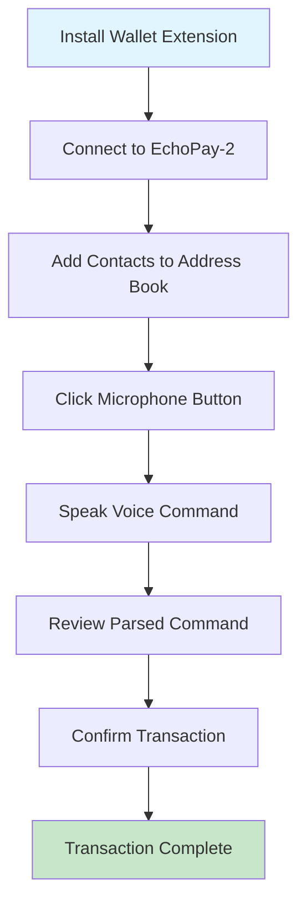

# MVP Features Implemented

## **Core Voice Functionality**
- **Web Speech API Integration**: Real-time voice recognition with visual feedback
- **Command Parsing**: Handles "Send 5 DOT to Alice" type commands
- **Voice Status Display**: Shows listening/processing/completed states

## **Polkadot Integration**
- **@polkadot/api**: Direct connection to Polkadot network
- **Wallet Support**: SubWallet and Talisman extension integration
- **Native DOT Transfers**: Uses `api.tx.balances.transferKeepAlive`
- **Balance Display**: Real-time account balance updates

## **User Interface**
- **Clean, Accessible Design**: High contrast, large buttons for voice interaction
- **Address Book**: Add/manage contacts with name-to-address mapping
- **Transaction History**: Track all voice-initiated payments
- **Responsive Layout**: Works on desktop and mobile

## **Smart Features**
- **Local Storage**: Persists contacts, history, and settings
- **Name Resolution**: "Send 5 DOT to Alice" resolves to actual addresses
- **Error Handling**: Clear feedback for all failure scenarios
- **Transaction Confirmation**: Shows parsed commands before execution

---

## 🎯 Supported Voice Commands

- `"Send [amount] DOT to [name/address]"`
- `"Check my balance"`
- `"Show transaction history"`
- `"Add contact [name] [address]"`

---

## 🚀 Try It Now

**Application URL**: [EchoPay-2 MVP](https://ppl-ai-code-interpreter-files.s3.amazonaws.com/web/direct-files/3da1fd47e23daa476b041f74a9a850b4/637f741e-966c-4764-ba71-8eb9b6217486/index.html)

---

## 📋 Next Steps for Testing

1. **Connect Wallet**: Install SubWallet or Talisman extension
2. **Add Contacts**: Create address book entries for easy voice commands
3. **Test Voice Commands**: Click microphone and speak "Send 1 DOT to Alice"
4. **Verify Transactions**: Check history and balance updates

---

## 🛠️ Quick Start Guide

---

## 🎙️ Voice Command Examples

| **Command** | **Example** | **Result** |
|-------------|-------------|------------|
| Send DOT | `"Send 5 DOT to Alice"` | Transfers 5 DOT to Alice's address |
| Check Balance | `"Check my balance"` | Displays current DOT balance |
| View History | `"Show transaction history"` | Lists recent transactions |
| Add Contact | `"Add contact Bob 1FRMM8PEiWXYax..."` | Saves Bob's address |

---

## ✨ Key Advantages

- **🚀 No Smart Contracts**: Direct Substrate runtime calls
- **💰 Lower Fees**: Native DOT transfers (no gas overhead)
- **🔒 Secure**: Battle-tested Polkadot runtime
- **📱 Accessible**: Voice-first interface for all users
- **⚡ Fast**: Direct API integration with real-time feedback
