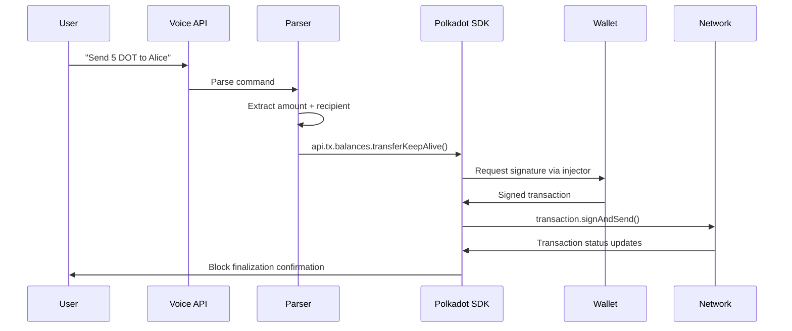

# Polkadot SDK Components Used

## 1. @polkadot/api - Core Blockchain Integration

```javascript
// Network Connection
this.api = await ApiPromise.create({ 
    provider: new WsProvider('wss://rpc.polkadot.io') 
});

// DOT Transfer Execution
const transfer = this.api.tx.balances.transferKeepAlive(
    recipient, 
    amount
);
await transfer.signAndSend(account, callback);
```

## 2. @polkadot/extension-dapp - Wallet Integration

```javascript
// Wallet Detection & Connection
const extensions = await web3Enable('EchoPay-2');
const accounts = await web3Accounts();
const injector = await web3FromAddress(selectedAccount.address);
```

---

## 🎯 Core Polkadot SDK Functionality Implemented

### **Native DOT Transfers**
- Uses `api.tx.balances.transferKeepAlive()` for secure DOT payments
- Direct integration with Polkadot's native balance module
- No smart contracts required for basic transfers

### **Account Management**
- Multi-account support via Polkadot's account system
- Address validation using Polkadot's SS58 format
- Balance querying: `api.query.system.account(address)`

### **Transaction Lifecycle**
- Transaction creation, signing, and submission
- Real-time transaction status tracking
- Block finalization confirmation

### **Network Integration**
- Connects to Polkadot mainnet (`wss://rpc.polkadot.io`)
- Support for testnets (Westend, Rococo)
- WebSocket RPC communication

---

## 🔄 Voice-to-Polkadot Workflow



**Step-by-Step Breakdown:**
1. **Voice Command**: `"Send 5 DOT to Alice"`
2. **Parse command** → Extract amount + recipient  
3. **Polkadot SDK**: `api.tx.balances.transferKeepAlive()`
4. **Wallet Extension**: Sign transaction via injector
5. **Submit**: `transaction.signAndSend()`
6. **Track**: Monitor transaction status
7. **Confirm**: Block finalization

---

## 📋 Key Differences from Original Hackathon Submission

### **Original Hackathon Version Used:**
- Moonbeam (Ethereum-compatible parachain)
- Hardhat + Solidity smart contracts
- Web3.js for Ethereum-style interactions

### **New MVP Uses:**
- Native Polkadot integration
- `@polkadot/api` SDK directly
- No smart contracts needed
- Pure DOT transfers via Substrate runtime

```mermaid
graph TD
    subgraph "Original Hackathon"
        A1[Voice Command] --> B1[Web3.js]
        B1 --> C1[Solidity Smart Contract]
        C1 --> D1[Moonbeam Parachain]
    end
    
    subgraph "New MVP"
        A2[Voice Command] --> B2[@polkadot/api]
        B2 --> C2[Native Balance Module]
        C2 --> D2[Polkadot Mainnet]
    end
    
    style A1 fill:#ff9999
    style A2 fill:#99ff99
```

---

## 🛠️ Technical Benefits

| **Aspect** | **Original** | **New MVP** |
|------------|-------------|-------------|
| **Complexity** | Smart contracts required | Direct runtime calls |
| **Gas Fees** | EVM gas costs | Native DOT fees |
| **Development** | Solidity + JavaScript | Pure JavaScript/TypeScript |
| **Performance** | EVM overhead | Native Substrate speed |
| **Security** | Smart contract risks | Battle-tested runtime |
