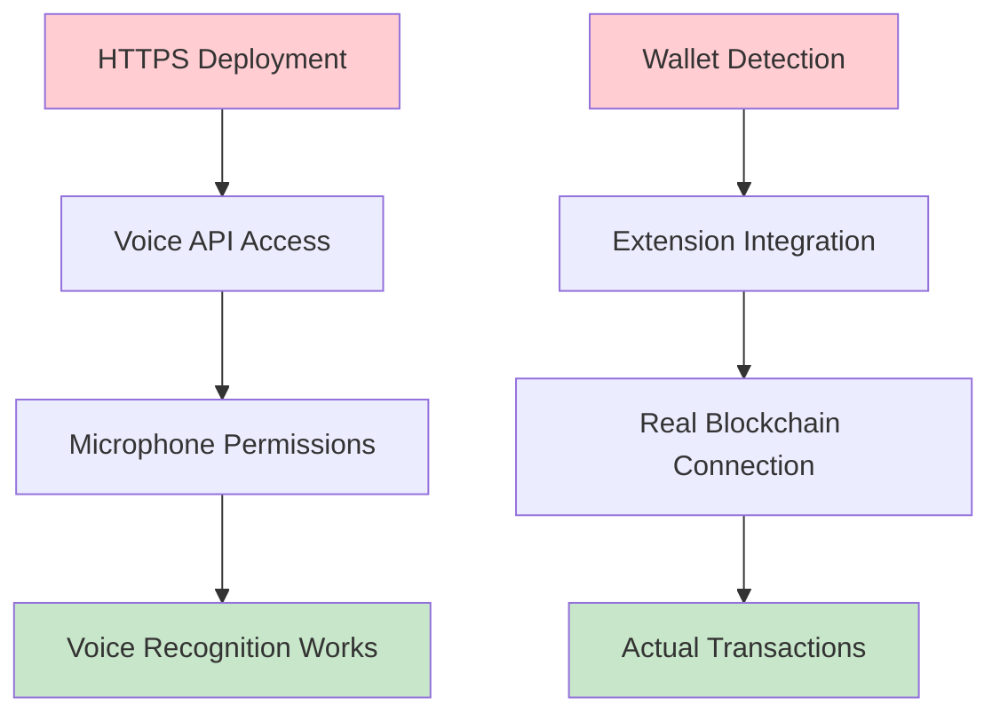

# Known Issues & Required Fixes

## 🔧 Technical Issues

### **1. Voice Recognition Failures**
- **Problem**: Voice recognition error: `not-allowed`
- **Root Cause**: Browser permissions and HTTPS requirements
- **Impact**: Core functionality completely broken
- **Fix Needed**:
  - Implement proper microphone permission handling
  - Add HTTPS deployment (required for Web Speech API)
  - Add fallback error messages with permission instructions

### **2. Wallet Integration Issues**
- **Problem**: `Wallet connection failed. Simulating connection for demo`
- **Root Cause**: Missing wallet extension detection logic
- **Impact**: No real blockchain connectivity
- **Fix Needed**:
  - Proper `@polkadot/extension-dapp` integration
  - Real wallet detection and connection flow
  - Error handling for missing extensions

### **3. Currency Confusion**
- **Problem**: Shows "WND" (Westend) instead of "DOT"
- **Root Cause**: Incorrect network configuration
- **Impact**: User confusion about which network they're using
- **Fix Needed**: Clear network selection and proper currency display

### **4. Missing Core Functionality**
- **Problems**:
  - No actual transaction execution
  - Voice commands don't trigger real payments
  - Demo data instead of real blockchain interaction

---

## 📱 UI/UX Issues

### **1. Visual Feedback Problems**
- Voice listening state is unclear
- No loading indicators during operations
- Error messages appear but don't clear properly

### **2. Mobile Responsiveness**
- Interface needs better mobile optimization
- Touch targets could be larger for accessibility

### **3. Address Book Issues**
- Contact removal works but UI doesn't update consistently
- Add contact validation works but UX could be smoother

---

## 🛠️ Technical Debt Summary

### **Blocking Issues (Must Fix)**

### **Quality of Life Issues**
- UI state management inconsistencies
- Missing loading states and error recovery
- Mobile usability improvements needed
- Better accessibility features required

---

## 📋 Suggested Fix Order

1. **🚀 Deploy to HTTPS** (enables voice features)
2. **🔗 Fix wallet integration** (enables real transactions)  
3. **🎙️ Improve voice permission handling** (better UX)
4. **💸 Implement actual transaction logic** (core functionality)
5. **🌐 Fix network/currency display** (reduces confusion)
6. **📱 Mobile optimization** (broader accessibility)
7. **✨ UI polish** (loading states, error handling)

---

## 💡 Quick Wins Available

- **Network Configuration**: Simple config change to show "DOT" instead of "WND"
- **Error Message Cleanup**: Add auto-dismiss timers for error states  
- **Touch Target Sizing**: CSS-only fixes for mobile accessibility
- **Loading Indicators**: Basic spinners during async operations
