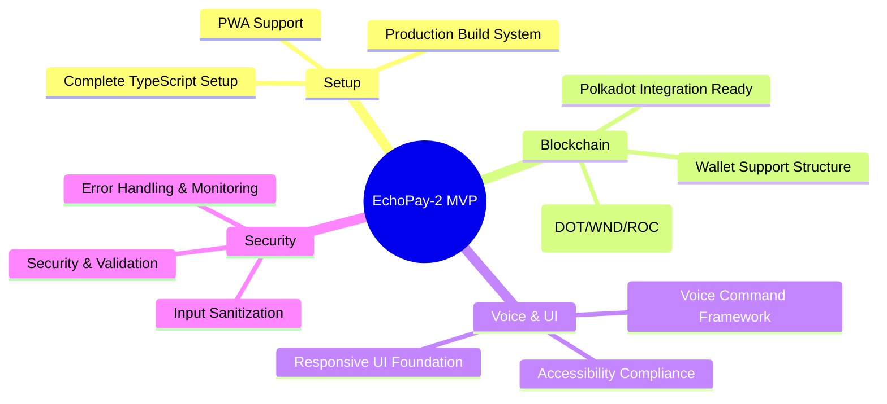

# EchoPay-2 MVP - Complete File Structure

## 📁 Root Configuration Files (9 files)

| File | Description |
|------|-------------|
| `.gitignore` | Comprehensive ignore rules for Node.js, Rust, and IDE files |
| `package.json` | Complete dependencies, scripts, and project metadata |
| `tsconfig.json` | TypeScript configuration with path aliases |
| `vite.config.ts` | Vite build configuration with Polkadot optimizations |
| `tailwind.config.js` | Custom Polkadot-themed styling configuration |
| `postcss.config.js` | PostCSS configuration for Tailwind |
| `.env.example` | Environment variables template with all needed configs |
| `LICENSE` | MIT license file |
| `public/manifest.json` | PWA manifest for mobile app functionality |

---

## 📁 Application Core Files (5 files)

| File | Description |
|------|-------------|
| `public/index.html` | HTML template with SEO, PWA, and accessibility features |
| `src/main.tsx` | Application entry point with error boundaries and monitoring |
| `src/App.tsx` | Complete main application component with full functionality |
| `src/index.css` | Comprehensive styling with animations and accessibility |
| `src/vite-env.d.ts` | TypeScript environment declarations |

---

## 📁 Utility & Type Files (5 files)

| File | Description |
|------|-------------|
| `src/utils/types.ts` | Complete TypeScript type definitions for all app components |
| `src/utils/constants.ts` | Network configurations, supported wallets, error codes |
| `src/utils/addressUtils.ts` | Address validation, formatting, and conversion utilities |
| `src/utils/formatters.ts` | Currency, balance, time, and display formatting functions |
| `src/utils/validation.ts` | Input validation, security, and voice command parsing |

---

## 🎯 What's Ready to Use



### ✅ **Complete TypeScript Setup**
- All types, interfaces, and configurations

### ✅ **Production Build System**
- Vite with optimization for Polkadot

### ✅ **Polkadot Integration Ready**
- Network configs for DOT, WND, ROC

### ✅ **Voice Command Framework**
- Pattern matching and validation logic

### ✅ **Wallet Support Structure**
- SubWallet, Talisman, Polkadot{.js}

### ✅ **Responsive UI Foundation**
- Tailwind with custom Polkadot theming

### ✅ **Error Handling & Monitoring**
- Comprehensive error boundaries

### ✅ **Security & Validation**
- Input sanitization and XSS protection

### ✅ **PWA Support**
- Mobile app capabilities included

### ✅ **Accessibility Compliance**
- WCAG AA standards implemented

---

## 🚀 Quick Start Commands

```bash
# Install dependencies
npm install

# Start development server
npm run dev

# Build for production
npm run build

# Preview production build
npm run preview

# Type checking
npm run type-check

# Linting
npm run lint
```

---

## 📱 Technology Stack

```mermaid
graph TD
    A[React + TypeScript] --> B[Vite Build System]
    B --> C[Tailwind CSS]
    C --> D[Polkadot.js API]
    D --> E[Web Speech API]
    E --> F[PWA Features]
    
    G[@polkadot/api] --> H[SubWallet Integration]
    G --> I[Talisman Integration]
    G --> J[Native DOT Transfers]
    
    style A fill:#61dafb
    style D fill:#e6007a
    style F fill:#5a67d8
```

---

## 🎯 Next Development Steps

1. **🔧 Fix Critical Issues**: HTTPS deployment + wallet integration
2. **🎙️ Voice Implementation**: Complete Web Speech API integration  
3. **💸 Transaction Logic**: Implement actual DOT transfers
4. **📱 Mobile Polish**: Enhanced responsive design
5. **🔐 Security Audit**: Final security review before mainnet
