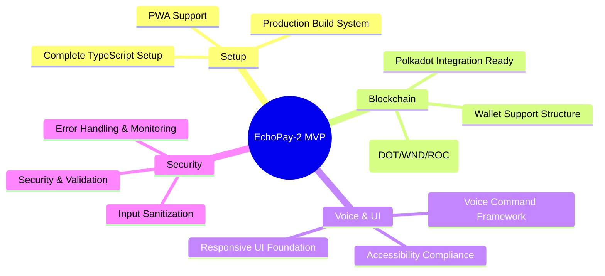

**Revolutionary voice-activated payment dApp that makes Polkadot blockchain accessible to everyone through natural language commands.**

> 🏆 **3rd Place Winner** - London Polkadot 2025 Hackathon  

---

## 🌟 Key Features

### 🎤 Voice-First Experience
- **Natural Language Processing** - "Send 5 DOT to Alice" 
- **Speech Recognition** - Browser-based Web Speech API
- **Voice Synthesis** - ElevenLabs powered responses
- **Accessibility Focus** - Support for users with disabilities

### 🔗 Polkadot Integration
- **Multi-Network Support** - DOT, WND, ROC, local networks
- **Wallet Compatibility** - SubWallet, Talisman, Polkadot{.js}
- **Native Transactions** - Direct blockchain interactions
- **Smart Contract Logging** - ink! payment recorder

### 🚀 Advanced Capabilities
- **Cross-Chain Ready** - Future XCM protocol support
- **Real-time Processing** - Instant voice command handling
- **Transaction History** - Complete payment tracking
- **Mobile Responsive** - PWA support for mobile devices

---

## 🏗️ Architecture Overview

### System Components

```
┌─────────────────┐    ┌─────────────────┐    ┌─────────────────┐
│   User Voice    │───▶│  Frontend App   │───▶│ Blockchain APIs │
│   Interface     │    │  (React/TS)     │    │  (Polkadot)     │
└─────────────────┘    └─────────────────┘    └─────────────────┘
         │                       │                       │
         ▼                       ▼                       ▼
┌─────────────────┐    ┌─────────────────┐    ┌─────────────────┐
│ Speech Services │    │ Wallet Services │    │ Smart Contracts │
│ (Recognition)   │    │ (SubWallet)     │    │ (ink! Records)  │
└─────────────────┘    └─────────────────┘    └─────────────────┘
```

### Technology Stack

| Layer | Technology | Purpose |
|-------|------------|---------|
| **Frontend** | React + TypeScript | User interface and interactions |
| **Build** | Vite + Tailwind CSS | Development and styling |
| **Blockchain** | Polkadot.js API | Network connectivity |
| **Voice** | Web Speech API + ElevenLabs | Voice processing |
| **Contracts** | ink! (Rust) | On-chain payment records |
| **Testing** | Vitest + Playwright | Unit and E2E testing |

---

## 🚀 Quick Start

### Prerequisites

- **Node.js** (v18+) and npm
- **Rust toolchain** (stable) 
- **Polkadot wallet extension** (SubWallet recommended)
- **Modern browser** with Web Speech API support


### First Transaction

1. 🔗 **Connect your wallet** (SubWallet/Talisman)
2. 🎤 **Click the microphone button**
3. 🗣️ **Say**: *"Send 1 WND to [address]"*
4. ✅ **Confirm transaction details**
5. 📝 **Sign with your wallet**
6. 🎉 **Receive voice confirmation**

---

## 📚 Usage Examples

### Voice Commands

| Command | Description | Example |
|---------|-------------|---------|
| **Send** | Transfer cryptocurrency | *"Send 5 DOT to Alice"* |
| **Balance** | Check account balance | *"Check my balance"* |
| **History** | View transactions | *"Show my history"* |
| **Help** | Available commands | *"Help"* |
| **Cancel** | Cancel operation | *"Cancel"* |

### Supported Networks

- **Polkadot Mainnet** (DOT) - Production network
- **Westend Testnet** (WND) - Primary testnet 
- **Rococo Testnet** (ROC) - Parachain testing
- **Local Node** (UNIT) - Development environment

---

## 🛠️ Development

# EchoPay-2 MVP - Complete File Structure

## 📁 Root Configuration Files (9 files)

| File | Description |
|------|-------------|
| `.gitignore` | Comprehensive ignore rules for Node.js, Rust, and IDE files |
| `package.json` | Complete dependencies, scripts, and project metadata |
| `tsconfig.json` | TypeScript configuration with path aliases |
| `vite.config.ts` | Vite build configuration with Polkadot optimizations |
| `tailwind.config.js` | Custom Polkadot-themed styling configuration |
| `postcss.config.js` | PostCSS configuration for Tailwind |
| `.env.example` | Environment variables template with all needed configs |
| `LICENSE` | MIT license file |
| `public/manifest.json` | PWA manifest for mobile app functionality |

---

## 📁 Application Core Files (5 files)

| File | Description |
|------|-------------|
| `public/index.html` | HTML template with SEO, PWA, and accessibility features |
| `src/main.tsx` | Application entry point with error boundaries and monitoring |
| `src/App.tsx` | Complete main application component with full functionality |
| `src/index.css` | Comprehensive styling with animations and accessibility |
| `src/vite-env.d.ts` | TypeScript environment declarations |

---

## 📁 Utility & Type Files (5 files)

| File | Description |
|------|-------------|
| `src/utils/types.ts` | Complete TypeScript type definitions for all app components |
| `src/utils/constants.ts` | Network configurations, supported wallets, error codes |
| `src/utils/addressUtils.ts` | Address validation, formatting, and conversion utilities |
| `src/utils/formatters.ts` | Currency, balance, time, and display formatting functions |
| `src/utils/validation.ts` | Input validation, security, and voice command parsing |

---

## 🎯 What's Ready to Use



### ✅ **Complete TypeScript Setup**
- All types, interfaces, and configurations

### ✅ **Production Build System**
- Vite with optimization for Polkadot

### ✅ **Polkadot Integration Ready**
- Network configs for DOT, WND, ROC

### ✅ **Voice Command Framework**
- Pattern matching and validation logic

### ✅ **Wallet Support Structure**
- SubWallet, Talisman, Polkadot{.js}

### ✅ **Responsive UI Foundation**
- Tailwind with custom Polkadot theming

### ✅ **Error Handling & Monitoring**
- Comprehensive error boundaries

### ✅ **Security & Validation**
- Input sanitization and XSS protection

### ✅ **PWA Support**
- Mobile app capabilities included

### ✅ **Accessibility Compliance**
- WCAG AA standards implemented

---

## 🚀 Quick Start Commands

```bash
# Install dependencies
npm install

# Start development server
npm run dev

# Build for production
npm run build

# Preview production build
npm run preview

# Type checking
npm run type-check

# Linting
npm run lint
```

---

## 📱 Technology Stack

```mermaid
graph TD
    A[React + TypeScript] --> B[Vite Build System]
    B --> C[Tailwind CSS]
    C --> D[Polkadot.js API]
    D --> E[Web Speech API]
    E --> F[PWA Features]
    
    G[@polkadot/api] --> H[SubWallet Integration]
    G --> I[Talisman Integration]
    G --> J[Native DOT Transfers]
    
    style A fill:#61dafb
    style D fill:#e6007a
    style F fill:#5a67d8
```

---

## 🎯 Next Development Steps

1. **🔧 Fix Critical Issues**: HTTPS deployment + wallet integration
2. **🎙️ Voice Implementation**: Complete Web Speech API integration  
3. **💸 Transaction Logic**: Implement actual DOT transfers
4. **📱 Mobile Polish**: Enhanced responsive design
5. **🔐 Security Audit**: Final security review before mainnet
