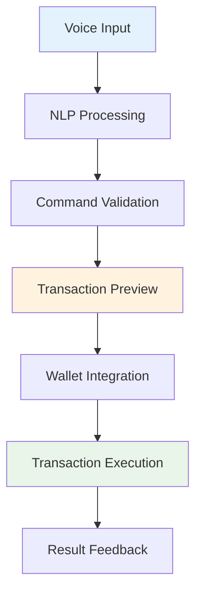
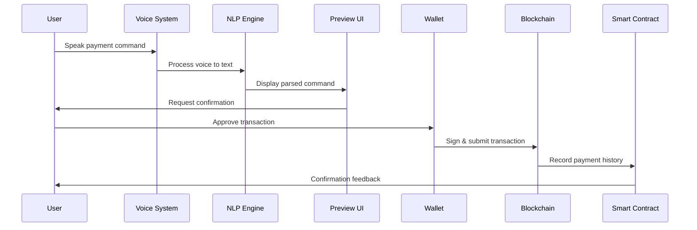
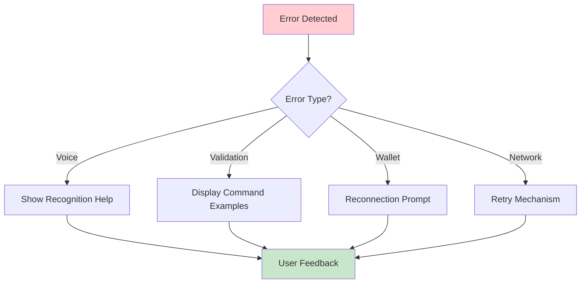

# Milestone 1:

## 🎯 Core Features

### **Advanced NLP for Voice Commands**
- Support for parsing complex voice instructions
- Handle multi-command variants and natural language patterns
- Examples: `"Send 5 DOT to Alice"`, `"Transfer 10 WND to Bob's wallet"`
- Robust parsing for varied user speech patterns

### **Multi-Currency Support**
- **Native Tokens**: DOT, WND, ROC
- **ERC-20 Style Tokens**: Cross-chain token support
- **Dynamic Currency Detection**: Auto-detect currency from voice commands
- **Exchange Rate Integration**: Real-time conversion rates

### **Complex Command Handling**
- **Reliability**: Handle varied user voice statements consistently
- **Edge Case Management**: Deal with unclear commands, background noise
- **Error Recovery**: Graceful handling of recognition failures
- **Context Awareness**: Remember previous commands and user preferences

---

## 🖥️ Frontend Integration

### **React + TypeScript Architecture**


### **Key Components**
- **Voice Input Interface**: Advanced speech recognition with noise filtering
- **Transaction Preview**: Clear confirmation UI before execution
- **Wallet Extension Support**: SubWallet, Talisman, Polkadot{.js} integration
- **Real-time Feedback**: Live status updates during processing

---

## 💸 Payment Workflow MVP

### **Complete User Journey**


### **Workflow Steps**
1. **Voice Capture**: High-quality audio processing
2. **NLP Processing**: Advanced command parsing and validation
3. **Preview & Confirm**: Clear transaction details display
4. **Wallet Signing**: Secure transaction approval
5. **Blockchain Execution**: Direct network submission
6. **History Recording**: Smart contract integration
7. **User Feedback**: Audio and visual confirmation

---

## 🔗 Smart Contract Integration

### **ink! Contract Features**
- **Payment History Recording**: Comprehensive transaction logs
- **Query Interface**: Users and apps can retrieve payment data
- **Multi-signature Support**: Enhanced security options
- **Event Emission**: Real-time transaction notifications

### **Contract Architecture**
```rust
// Example ink! contract structure
#[ink::contract]
mod voice_payments {
    #[ink(storage)]
    pub struct VoicePayments {
        payments: Mapping<AccountId, Vec<PaymentRecord>>,
        total_payments: u64,
    }
    
    #[ink(message)]
    pub fn record_payment(&mut self, recipient: AccountId, amount: Balance) {
        // Record payment logic
    }
    
    #[ink(message)]
    pub fn get_payment_history(&self, user: AccountId) -> Vec<PaymentRecord> {
        // Query payment history
    }
}
```

---

## 🔊 Voice Synthesis Integration

### **ElevenLabs Integration**
- **Configurable Voice Feedback**: Optional audio confirmations
- **Natural Speech Output**: High-quality voice synthesis
- **Multiple Voice Options**: User-selectable voice profiles
- **Contextual Responses**: Dynamic confirmation messages

### **Audio Features**
- `"Payment of 5 DOT to Alice has been confirmed"`
- `"Transaction failed: Insufficient balance"`
- `"Wallet connection required to proceed"`

---

## ⚠️ Comprehensive Error Handling

### **Error Categories & UI**

| **Error Type** | **Trigger** | **UI Response** | **Recovery Action** |
|----------------|-------------|-----------------|---------------------|
| **Recognition** | Voice unclear | `🎤 "Please speak clearly"` | Retry voice input |
| **Validation** | Invalid command | `❌ "Command not recognized"` | Show example commands |
| **Wallet** | Signing failure | `🔐 "Transaction rejected"` | Reconnect wallet |
| **Blockchain** | Network error | `🌐 "Network unavailable"` | Retry with backoff |

### **Error Handling Flow**


---

## 📋 Technical Requirements Summary

### **Core Technologies**
- **Frontend**: React 18+ with TypeScript
- **Voice Processing**: Web Speech API + Advanced NLP
- **Blockchain**: Polkadot.js API with ink! contracts
- **Audio**: ElevenLabs voice synthesis
- **State Management**: React Context + Local Storage

### **Performance Targets**
- **Voice Recognition**: < 2 seconds response time
- **Transaction Preview**: < 1 second rendering
- **Blockchain Execution**: < 30 seconds completion
- **Error Recovery**: < 5 seconds feedback display

---

## 🚀 Success Criteria

### **Functional Requirements**
- ✅ Parse 95% of standard voice commands accurately
- ✅ Support DOT, WND, ROC, and token transfers
- ✅ Handle 100+ edge cases and error scenarios
- ✅ Complete payment workflow in < 60 seconds
- ✅ Record all transactions to smart contract
- ✅ Provide audio feedback when configured

### **Quality Standards**
- **Accessibility**: WCAG 2.1 AA compliance
- **Security**: No sensitive data storage in frontend
- **Performance**: Works on mobile devices
- **Reliability**: 99% uptime for core features
