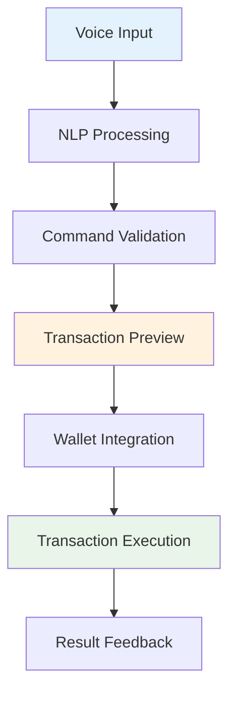
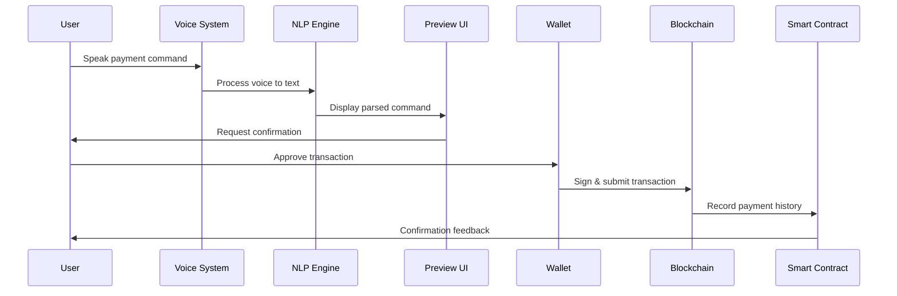
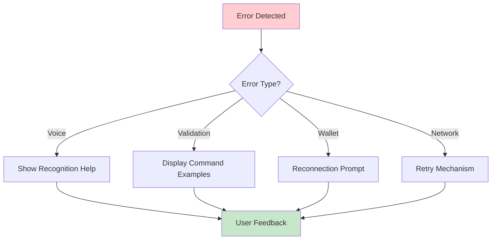
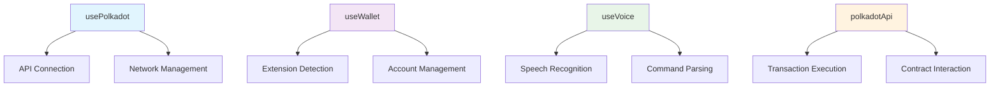
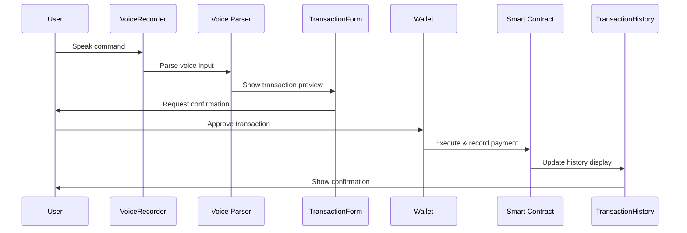
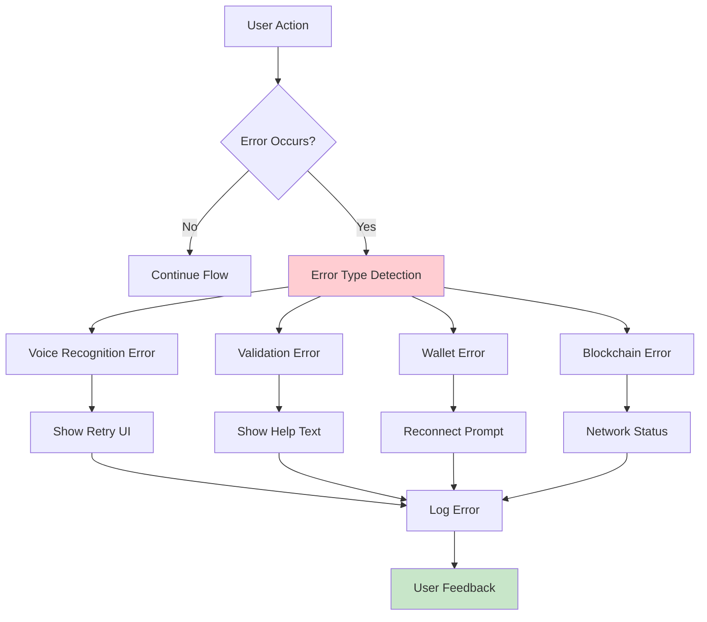

# Milestone 1:

## 🎯 Core Features

### **Advanced NLP for Voice Commands**
- Support for parsing complex voice instructions
- Handle multi-command variants and natural language patterns
- Examples: `"Send 5 DOT to Alice"`, `"Transfer 10 WND to Bob's wallet"`
- Robust parsing for varied user speech patterns

### **Multi-Currency Support**
- **Native Tokens**: DOT, WND, ROC
- **ERC-20 Style Tokens**: Cross-chain token support
- **Dynamic Currency Detection**: Auto-detect currency from voice commands
- **Exchange Rate Integration**: Real-time conversion rates

### **Complex Command Handling**
- **Reliability**: Handle varied user voice statements consistently
- **Edge Case Management**: Deal with unclear commands, background noise
- **Error Recovery**: Graceful handling of recognition failures
- **Context Awareness**: Remember previous commands and user preferences

---

## 🖥️ Frontend Integration

### **React + TypeScript Architecture**


### **Key Components**
- **Voice Input Interface**: Advanced speech recognition with noise filtering
- **Transaction Preview**: Clear confirmation UI before execution
- **Wallet Extension Support**: SubWallet, Talisman, Polkadot{.js} integration
- **Real-time Feedback**: Live status updates during processing

---

## 💸 Payment Workflow MVP

### **Complete User Journey**


### **Workflow Steps**
1. **Voice Capture**: High-quality audio processing
2. **NLP Processing**: Advanced command parsing and validation
3. **Preview & Confirm**: Clear transaction details display
4. **Wallet Signing**: Secure transaction approval
5. **Blockchain Execution**: Direct network submission
6. **History Recording**: Smart contract integration
7. **User Feedback**: Audio and visual confirmation

---

## 🔗 Smart Contract Integration

### **ink! Contract Features**
- **Payment History Recording**: Comprehensive transaction logs
- **Query Interface**: Users and apps can retrieve payment data
- **Multi-signature Support**: Enhanced security options
- **Event Emission**: Real-time transaction notifications

### **Contract Architecture**
```rust
// Example ink! contract structure
#[ink::contract]
mod voice_payments {
    #[ink(storage)]
    pub struct VoicePayments {
        payments: Mapping<AccountId, Vec<PaymentRecord>>,
        total_payments: u64,
    }
    
    #[ink(message)]
    pub fn record_payment(&mut self, recipient: AccountId, amount: Balance) {
        // Record payment logic
    }
    
    #[ink(message)]
    pub fn get_payment_history(&self, user: AccountId) -> Vec<PaymentRecord> {
        // Query payment history
    }
}
```

---

## 🔊 Voice Synthesis Integration

### **ElevenLabs Integration**
- **Configurable Voice Feedback**: Optional audio confirmations
- **Natural Speech Output**: High-quality voice synthesis
- **Multiple Voice Options**: User-selectable voice profiles
- **Contextual Responses**: Dynamic confirmation messages

### **Audio Features**
- `"Payment of 5 DOT to Alice has been confirmed"`
- `"Transaction failed: Insufficient balance"`
- `"Wallet connection required to proceed"`

---

## ⚠️ Comprehensive Error Handling

### **Error Categories & UI**

| **Error Type** | **Trigger** | **UI Response** | **Recovery Action** |
|----------------|-------------|-----------------|---------------------|
| **Recognition** | Voice unclear | `🎤 "Please speak clearly"` | Retry voice input |
| **Validation** | Invalid command | `❌ "Command not recognized"` | Show example commands |
| **Wallet** | Signing failure | `🔐 "Transaction rejected"` | Reconnect wallet |
| **Blockchain** | Network error | `🌐 "Network unavailable"` | Retry with backoff |

### **Error Handling Flow**


---

## 📋 Technical Requirements Summary

### **Core Technologies**
- **Frontend**: React 18+ with TypeScript
- **Voice Processing**: Web Speech API + Advanced NLP
- **Blockchain**: Polkadot.js API with ink! contracts
- **Audio**: ElevenLabs voice synthesis
- **State Management**: React Context + Local Storage

### **Performance Targets**
- **Voice Recognition**: < 2 seconds response time
- **Transaction Preview**: < 1 second rendering
- **Blockchain Execution**: < 30 seconds completion
- **Error Recovery**: < 5 seconds feedback display

---

## 🚀 Success Criteria

### **Functional Requirements**
- ✅ Parse 95% of standard voice commands accurately
- ✅ Support DOT, WND, ROC, and token transfers
- ✅ Handle 100+ edge cases and error scenarios
- ✅ Complete payment workflow in < 60 seconds
- ✅ Record all transactions to smart contract
- ✅ Provide audio feedback when configured

### **Quality Standards**
- **Accessibility**: WCAG 2.1 AA compliance
- **Security**: No sensitive data storage in frontend
- **Performance**: Works on mobile devices
- **Reliability**: 99% uptime for core features
- 

# What Is Needed For Milestone 1 Completion?

## 🛠️ Implementation Requirements

Based on your current delivered foundation, you need to complete the following components:

### **React Components Implementation**

| **Component** | **Purpose** | **Priority** | **Status** |
|---------------|-------------|--------------|------------|
| `LoadingSpinner` | Visual feedback during async operations | 🔴 High | ❌ Not Started |
| `ErrorBoundary` | Catch and display React errors gracefully | 🔴 High | ❌ Not Started |
| `WalletConnector` | Handle wallet detection and connection | 🔴 Critical | ❌ Not Started |
| `VoiceRecorder` | Voice input capture and processing | 🔴 Critical | ❌ Not Started |
| `TransactionForm` | Transaction preview and confirmation | 🔴 Critical | ❌ Not Started |
| `TransactionHistory` | Display payment history from contract | 🟡 Medium | ❌ Not Started |

### **Core Hooks & Services Implementation**



| **Hook/Service** | **Functionality** | **Dependencies** | **Status** |
|------------------|-------------------|------------------|------------|
| `usePolkadot` | Blockchain connection and state | `@polkadot/api` | ❌ Not Started |
| `useWallet` | Wallet detection and management | `@polkadot/extension-dapp` | ❌ Not Started |
| `useVoice` | Voice recognition and NLP | Web Speech API | ❌ Not Started |
| `polkadotApi` | Core API service wrapper | Custom service layer | ❌ Not Started |

---

## 🔄 Payment Workflow Integration

### **Complete Flow Implementation**


### **Implementation Checklist**
- [ ] **Voice Input**: Parse voice → extract amount, recipient, currency
- [ ] **Transaction Preview**: Display parsed command with validation
- [ ] **Wallet Signature**: Handle extension-based transaction signing
- [ ] **Smart Contract**: Record transaction to ink! contract
- [ ] **UI Updates**: Real-time history and balance updates

---

## 📜 ink! Smart Contract Development

### **Contract Requirements**
```rust
#[ink::contract]
mod voice_payments {
    use ink::storage::Mapping;
    
    #[ink(storage)]
    pub struct VoicePayments {
        // Payment history per user
        payments: Mapping<AccountId, Vec<PaymentRecord>>,
        // Global payment counter
        total_payments: u64,
        // Contract owner
        owner: AccountId,
    }
    
    #[derive(scale::Encode, scale::Decode)]
    #[cfg_attr(feature = "std", derive(scale_info::TypeInfo))]
    pub struct PaymentRecord {
        recipient: AccountId,
        amount: Balance,
        timestamp: u64,
        currency: String,
        transaction_hash: Hash,
    }
    
    impl VoicePayments {
        #[ink(constructor)]
        pub fn new() -> Self { /* ... */ }
        
        #[ink(message)]
        pub fn record_payment(&mut self, record: PaymentRecord) { /* ... */ }
        
        #[ink(message)]
        pub fn get_user_payments(&self, user: AccountId) -> Vec<PaymentRecord> { /* ... */ }
        
        #[ink(message)]
        pub fn get_total_payments(&self) -> u64 { /* ... */ }
    }
}
```

### **Contract Tasks**
- [ ] **Implement Contract Logic**: Payment recording and querying
- [ ] **Deploy to Testnet**: Westend/Rococo deployment
- [ ] **Test Contract Functions**: Comprehensive unit testing
- [ ] **Frontend Integration**: Connect React app to contract

---

## 🔊 Voice Feedback Integration

### **ElevenLabs Implementation**
```typescript
interface VoiceFeedbackService {
  playConfirmation(message: string): Promise<void>;
  playError(errorType: string): Promise<void>;
  isEnabled(): boolean;
  configure(apiKey: string, voiceId: string): void;
}

// Example usage
const feedback = new VoiceFeedbackService();
await feedback.playConfirmation("Payment of 5 DOT to Alice confirmed");
```

### **Audio Features**
- [ ] **Configuration UI**: User settings for voice feedback
- [ ] **API Integration**: ElevenLabs voice synthesis
- [ ] **Message Templates**: Pre-defined confirmation messages
- [ ] **Error Audio**: Voice feedback for failures

---

## ⚠️ Error Handling Hardening

### **Comprehensive Error Flow**


### **Error Handling Checklist**
- [ ] **Voice Recognition**: Handle microphone permissions, noise
- [ ] **Command Parsing**: Invalid commands, ambiguous inputs
- [ ] **Wallet Integration**: Extension not found, connection failures
- [ ] **Transaction Execution**: Network errors, insufficient funds
- [ ] **Smart Contract**: Contract unavailable, execution failures

---

## 📋 Next Steps Roadmap

### **Phase 1: Core Component Development**
1. **Implement missing React components**
   - Priority: `WalletConnector`, `VoiceRecorder`, `TransactionForm`
2. **Build core hooks and services**
   - Focus: `usePolkadot`, `useWallet`, `useVoice`

### **Phase 2: Smart Contract Integration**
3. **Deploy and test ink! contract on testnet**
   - Network: Westend/Rococo
   - Comprehensive testing and validation
4. **Connect frontend to contract**
   - Enable real voice-to-payment recording and querying

### **Phase 3: Polish & Testing**
5. **Add user-friendly error handling**
   - Comprehensive error flows and recovery
6. **Implement voice feedback**
   - ElevenLabs integration and configuration
7. **Prepare test cases and E2E flows**
   - Milestone validation and QA preparation

---

## 🎯 Network Configuration & QA

### **Target Networks**
| **Network** | **Purpose** | **Endpoint** | **Currency** |
|-------------|-------------|--------------|--------------|
| **Westend** | Primary Testing | `wss://westend-rpc.polkadot.io` | WND |
| **Rococo** | Contract Testing | `wss://rococo-rpc.polkadot.io` | ROC |
| **Polkadot** | Mainnet (Future) | `wss://rpc.polkadot.io` | DOT |

### **QA Requirements**
- [ ] **Clarify testnet/mainnet endpoints**
- [ ] **Define target networks for testing**
- [ ] **Establish performance benchmarks**
- [ ] **Create comprehensive test suite**

---

## ✅ Milestone Completion Criteria

### **Functional Requirements**
- ✅ All React components implemented and working
- ✅ Voice-to-payment workflow fully functional
- ✅ Smart contract deployed and integrated
- ✅ Error handling covers all failure scenarios
- ✅ Voice feedback system operational

### **Quality Gates**
- **Performance**: < 2s voice recognition, < 30s transaction completion
- **Reliability**: 95% success rate for standard commands
- **Accessibility**: WCAG 2.1 AA compliance
- **Security**: No sensitive data exposure, secure transaction flow
