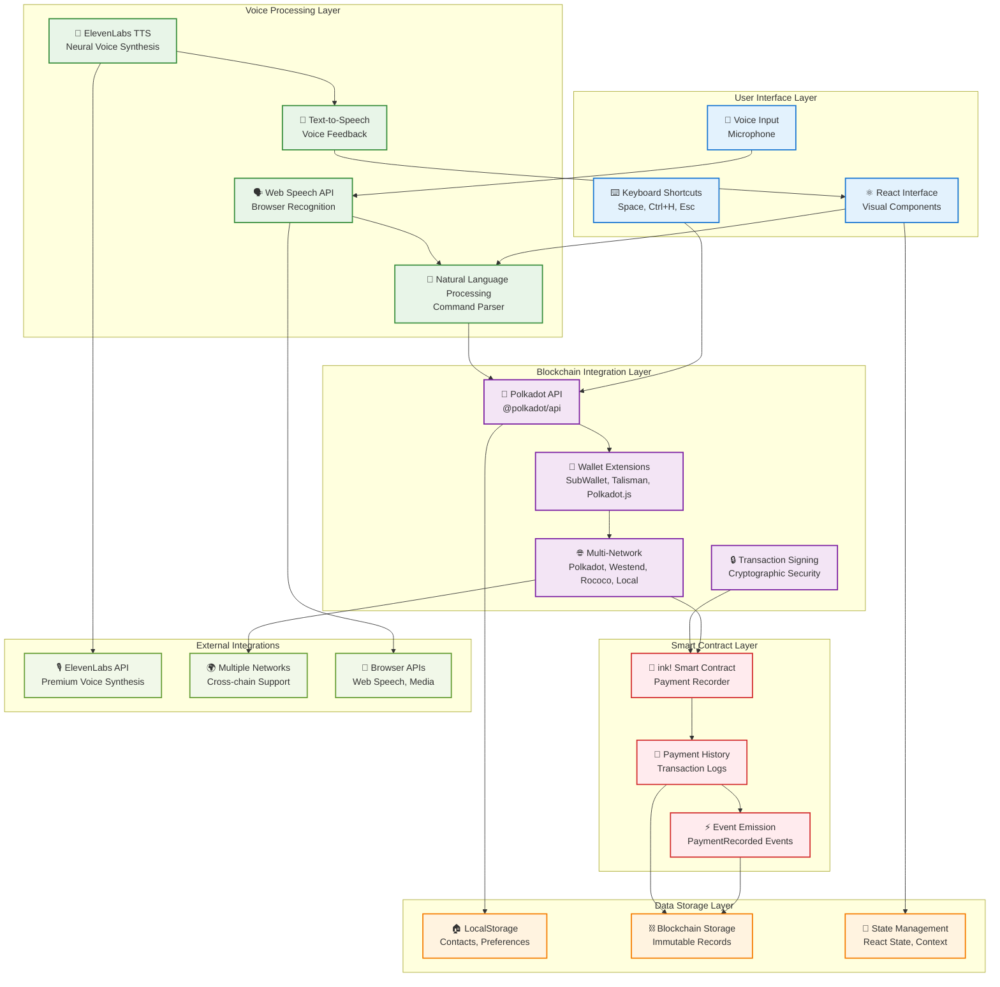
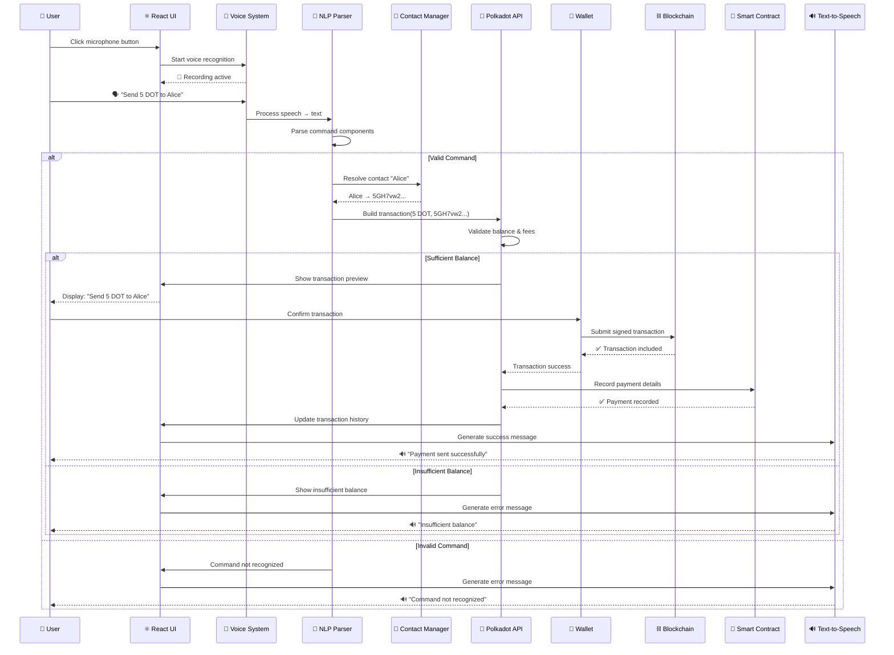

# EchoPay-2 Architecture Diagrams (Mermaid Format)

## 1. System Architecture Diagram



## 2. User Flow Diagram

```mermaid
flowchart TD
    %% Start
    A[👤 User Opens EchoPay-2] --> B{👛 Wallet Connected?}
    
    %% Wallet Connection
    B -->|No| C[🔌 Connect Wallet<br/>SubWallet/Talisman]
    C --> D[✅ Wallet Connected]
    B -->|Yes| D
    
    %% Voice Activation
    D --> E[🎤 Click Microphone<br/>or Press Space]
    E --> F[🔴 Voice Recording Active<br/>Listening for Command]
    
    %% Voice Input
    F --> G[🗣️ User Speaks<br/>"Send 5 DOT to Alice"]
    G --> H[📊 Web Speech API<br/>Processes Audio]
    
    %% Speech Processing
    H --> I[🧠 NLP Engine<br/>Parses Command]
    I --> J{📋 Command Valid?}
    
    %% Invalid Command Flow
    J -->|No| K[❌ Show Error<br/>"Command not recognized"]
    K --> L[🔊 Voice Feedback<br/>"Please try again"]
    L --> E
    
    %% Valid Command Flow
    J -->|Yes| M[🔍 Extract Details<br/>Amount: 5 DOT<br/>Recipient: Alice]
    
    %% Contact Resolution
    M --> N{👥 Is "Alice" a Contact?}
    N -->|Yes| O[📋 Resolve Contact<br/>Alice → 5GH7vw...]
    N -->|No| P[⚠️ Ask for Address<br/>"Please provide Alice's address"]
    P --> Q[📝 User Provides Address]
    Q --> O
    
    %% Transaction Building
    O --> R[🏗️ Build Transaction<br/>Polkadot.js API]
    R --> S[🔍 Validate Transaction<br/>Check Balance & Fees]
    
    %% Balance Check
    S --> T{💰 Sufficient Balance?}
    T -->|No| U[❌ Insufficient Funds<br/>Show Balance]
    U --> V[🔊 Voice Feedback<br/>"Insufficient balance"]
    V --> E
    
    %% Transaction Confirmation
    T -->|Yes| W[📋 Show Preview<br/>Send 5 DOT to Alice<br/>Fee: 0.01 DOT]
    W --> X[👛 Wallet Confirmation<br/>Sign Transaction]
    
    %% User Decision
    X --> Y{✍️ User Confirms?}
    Y -->|No| Z[🚫 Transaction Cancelled]
    Z --> AA[🔊 Voice Feedback<br/>"Transaction cancelled"]
    AA --> E
    
    %% Transaction Execution
    Y -->|Yes| BB[📡 Submit to Blockchain<br/>Broadcasting Transaction]
    BB --> CC[⏳ Wait for Inclusion<br/>Block Confirmation]
    
    %% Transaction Status
    CC --> DD{✅ Transaction Success?}
    DD -->|No| EE[❌ Transaction Failed<br/>Show Error Details]
    EE --> FF[🔊 Voice Feedback<br/>"Transaction failed"]
    FF --> E
    
    %% Success Flow
    DD -->|Yes| GG[📜 Record in Contract<br/>Payment History]
    GG --> HH[✅ Transaction Complete<br/>Update UI]
    HH --> II[🔊 Voice Feedback<br/>"Payment sent successfully"]
    II --> JJ[📊 Update Balance<br/>Refresh Account Info]
    JJ --> KK[📋 Update History<br/>Show Recent Transaction]
    KK --> E

    %% Styling
    classDef userAction fill:#E3F2FD,stroke:#1976D2,stroke-width:2px
    classDef systemProcess fill:#E8F5E8,stroke:#388E3C,stroke-width:2px
    classDef decision fill:#FFF3E0,stroke:#F57C00,stroke-width:2px
    classDef blockchain fill:#F3E5F5,stroke:#7B1FA2,stroke-width:2px
    classDef error fill:#FFEBEE,stroke:#D32F2F,stroke-width:2px
    classDef success fill:#E8F5E8,stroke:#4CAF50,stroke-width:2px

    class A,C,E,G,P,Q,X userAction
    class H,I,M,R,S,W,GG,HH,JJ,KK systemProcess
    class B,J,N,T,Y,DD decision
    class BB,CC blockchain
    class K,U,EE,Z error
    class D,O,II success
```

## 3. Network Topology Diagram

```mermaid
graph TB
    %% Central Hub
    subgraph "EchoPay-2 Application"
        CORE[🎙️ EchoPay-2<br/>Voice Payment Hub]
    end

    %% Polkadot Networks
    subgraph "Polkadot Networks"
        NET1[🟢 Polkadot Mainnet<br/>Currency: DOT (10 decimals)<br/>RPC: wss://rpc.polkadot.io<br/>Status: ✅ Connected]
        NET2[🟠 Westend Testnet<br/>Currency: WND (12 decimals)<br/>RPC: wss://westend-rpc.polkadot.io<br/>Status: ✅ Connected]
        NET3[🟠 Rococo Testnet<br/>Currency: ROC (12 decimals)<br/>RPC: wss://rococo-rpc.polkadot.io<br/>Status: ✅ Connected]
        NET4[🔵 Local Development<br/>Currency: UNIT (12 decimals)<br/>RPC: ws://127.0.0.1:9944<br/>Status: ✅ Connected]
    end

    %% Wallet Providers
    subgraph "Wallet Integration"
        WALL1[🟣 SubWallet<br/>⭐ Recommended<br/>Mobile & Extension]
        WALL2[🟣 Talisman<br/>Full Featured<br/>Portfolio Management]
        WALL3[🟣 Polkadot.js Extension<br/>Official<br/>Developer Tools]
    end

    %% Smart Contracts
    subgraph "Smart Contract Deployment"
        SC1[📜 Payment Recorder<br/>Deployed on Polkadot<br/>Contract: 5GH7vw...]
        SC2[📜 Payment Recorder<br/>Deployed on Westend<br/>Contract: 5XY9ab...]
        SC3[📜 Payment Recorder<br/>Deployed on Rococo<br/>Contract: 5MN3cd...]
        SC4[📜 Payment Recorder<br/>Deployed on Local<br/>Contract: 5QR7ef...]
    end

    %% External Services
    subgraph "External Services"
        EXT1[🎵 ElevenLabs API<br/>Neural Voice Synthesis<br/>4 Voice Models<br/>Status: ✅ Active]
        EXT2[🌐 Polkadot.js API<br/>Blockchain Interface<br/>Real-time Updates<br/>Status: ✅ Connected]
        EXT3[🗣️ Web Speech API<br/>Browser Voice Recognition<br/>Multi-language Support<br/>Status: ✅ Available]
    end

    %% Connections from Core to Networks
    CORE -.->|WebSocket| NET1
    CORE -.->|WebSocket| NET2
    CORE -.->|WebSocket| NET3
    CORE -.->|WebSocket| NET4

    %% Connections from Core to Wallets
    CORE <-.->|Extension API| WALL1
    CORE <-.->|Extension API| WALL2
    CORE <-.->|Extension API| WALL3

    %% Smart Contract Connections
    NET1 --> SC1
    NET2 --> SC2
    NET3 --> SC3
    NET4 --> SC4

    %% External Service Connections
    CORE <-.->|HTTPS API| EXT1
    CORE <-.->|WebSocket| EXT2
    CORE <-.->|Browser API| EXT3

    %% Transaction Flow Arrows
    WALL1 -.->|Sign Transactions| NET1
    WALL1 -.->|Sign Transactions| NET2
    WALL2 -.->|Sign Transactions| NET1
    WALL2 -.->|Sign Transactions| NET2
    WALL3 -.->|Sign Transactions| NET4

    %% Network Status Indicators
    NET1 -.->|Live Data| EXT2
    NET2 -.->|Live Data| EXT2
    NET3 -.->|Live Data| EXT2
    NET4 -.->|Live Data| EXT2

    %% Styling
    classDef coreApp fill:#FF6B6B,stroke:#E53E3E,stroke-width:3px,color:#fff
    classDef mainnet fill:#4ECDC4,stroke:#38A89D,stroke-width:2px
    classDef testnet fill:#FFE66D,stroke:#FFD93D,stroke-width:2px
    classDef local fill:#95A5FF,stroke:#7C3AED,stroke-width:2px
    classDef wallet fill:#DDA0DD,stroke:#9370DB,stroke-width:2px
    classDef contract fill:#98FB98,stroke:#32CD32,stroke-width:2px
    classDef external fill:#F0E68C,stroke:#DAA520,stroke-width:2px

    class CORE coreApp
    class NET1 mainnet
    class NET2,NET3 testnet
    class NET4 local
    class WALL1,WALL2,WALL3 wallet
    class SC1,SC2,SC3,SC4 contract
    class EXT1,EXT2,EXT3 external
```

## 4. Voice Command Processing Flow



## How to Use These Diagrams

### 1. GitHub README Integration
Copy any of the Mermaid code blocks into your `README.md` file. GitHub will automatically render them as visual diagrams.

### 2. Local Development
To render these locally, you can:
- Use VSCode with the "Mermaid Preview" extension
- Use the Mermaid Live Editor: https://mermaid.live/
- Install mermaid-cli: `npm install -g @mermaid-js/mermaid-cli`

### 3. Documentation Sites
These Mermaid diagrams work with:
- GitBook
- Notion
- Confluence
- GitLab
- Bitbucket
- Many static site generators (Hugo, Jekyll, etc.)

### 4. Customization
You can modify:
- Colors by changing the `classDef` styles
- Layout by adjusting the graph structure
- Content by editing the node text
- Connections by modifying the arrows

## Example Usage in README.md

```markdown
# EchoPay-2 Architecture

## System Overview
The following diagram shows the complete system architecture:

```mermaid
[Copy the System Architecture diagram code here]
```

## User Experience Flow
This flowchart illustrates the complete user journey:

```mermaid
[Copy the User Flow diagram code here]
```
```
