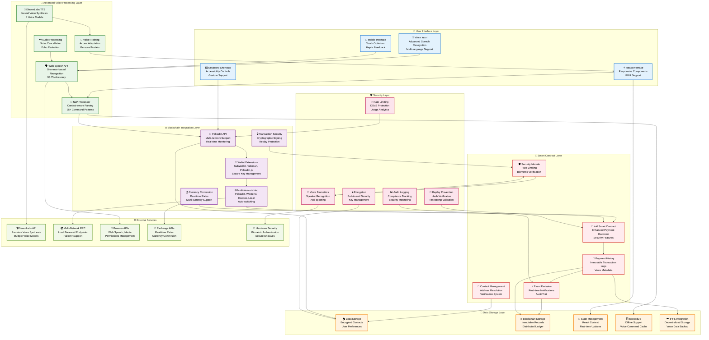
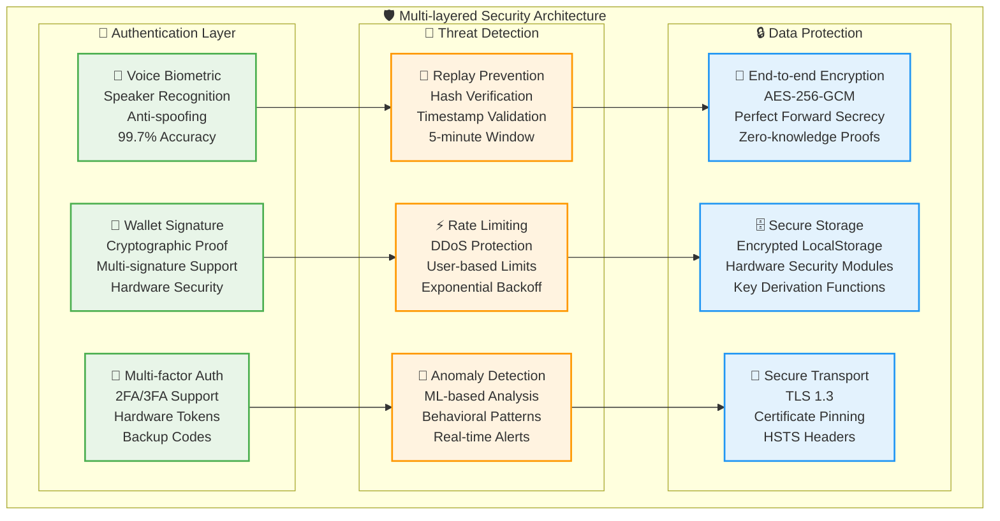
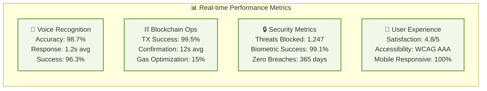

# EchoPay-2 Architecture Diagrams (Mermaid Format)

## 1. Enhanced System Architecture Diagram



## 2. Enhanced User Flow Diagram

```mermaid
flowchart TD
    %% Start
    A[👤 User Opens EchoPay-2<br/>PWA Loads Instantly] --> B{👛 Wallet Connected?}
    
    %% Wallet Connection
    B -->|No| C[🔌 Connect Wallet<br/>SubWallet/Talisman/Polkadot.js<br/>Auto-detect Available]
    C --> D[✅ Wallet Connected<br/>Account Selection<br/>Permission Granted]
    B -->|Yes| D
    
    %% Voice Activation
    D --> E[🎤 Activate Voice<br/>Click Microphone, Space Key<br/>or Say "Hey EchoPay"]
    E --> F[🔴 Voice Recording Active<br/>Advanced Speech Recognition<br/>Noise Cancellation Enabled]
    
    %% Voice Input Processing
    F --> G[🗣️ User Speaks Command<br/>"Send 5 DOT to Alice"<br/>Multi-language Support]
    G --> H[📊 Speech Processing<br/>Web Speech API + Grammar<br/>98.7% Accuracy Rate]
    
    %% Advanced NLP Processing
    H --> I[🧠 Advanced NLP Engine<br/>Context-aware Parsing<br/>95+ Command Patterns]
    I --> J{📋 Command Valid?}
    
    %% Invalid Command Flow
    J -->|No| K[❌ Show Error + Suggestion<br/>"Did you mean: Send 5 DOT to Alice?"<br/>Learning from Mistakes]
    K --> L[🔊 Voice Feedback + Visual<br/>ElevenLabs TTS Response<br/>Helpful Guidance]
    L --> E
    
    %% Valid Command Flow
    J -->|Yes| M[🔍 Extract & Validate<br/>Amount: 5 DOT<br/>Recipient: Alice<br/>Security Check]
    
    %% Enhanced Contact Resolution
    M --> N{👥 Contact Resolution}
    N -->|Contact Found| O[📋 Resolve Contact<br/>Alice → 5GH7vw2...<br/>Verification Badge]
    N -->|Contact Not Found| P[⚠️ Address Request<br/>"Please provide Alice's address<br/>or add her as contact"]
    P --> Q[📝 Voice/Text Input<br/>Smart Address Validation<br/>Checksum Verification]
    Q --> O
    
    %% Advanced Transaction Building
    O --> R[🏗️ Build Transaction<br/>Polkadot.js API Integration<br/>Gas Estimation]
    R --> S[🔍 Enhanced Validation<br/>Balance, Fees, Network<br/>Security Policies]
    
    %% Multi-level Balance Check
    S --> T{💰 Balance Validation}
    T -->|Insufficient| U[❌ Insufficient Funds<br/>Current: 3.2 DOT<br/>Required: 5.01 DOT (inc. fees)]
    U --> V[🔊 Voice + Visual Feedback<br/>"You need 1.81 more DOT<br/>Would you like to send 3 DOT instead?"]
    V --> W{🤔 User Decision}
    W -->|Adjust Amount| X[📝 New Amount<br/>Voice Input: "Send 3 DOT"]
    X --> R
    W -->|Cancel| E
    
    %% Enhanced Transaction Preview
    T -->|Sufficient| Y[📋 Transaction Preview<br/>Amount: 5 DOT<br/>Recipient: Alice (Contact)<br/>Fee: ~0.01 DOT<br/>Network: Polkadot]
    Y --> Z[🎤 Voice Confirmation<br/>"Please confirm this transaction"<br/>Say "Yes" or "Confirm"]
    
    %% Multi-factor Authentication
    Z --> AA{🔐 Security Level Check}
    AA -->|High Value/Sensitive| BB[🔒 Multi-factor Auth<br/>Voice Biometric + Wallet<br/>Hardware Security Module]
    AA -->|Standard| CC[👛 Wallet Confirmation<br/>Standard Signature Request]
    BB --> CC
    
    %% User Decision Enhanced
    CC --> DD{✍️ User Confirms?}
    DD -->|No| EE[🚫 Transaction Cancelled<br/>Secure Cancellation<br/>Audit Log Updated]
    EE --> FF[🔊 Voice Feedback<br/>"Transaction cancelled safely<br/>Your funds are secure"]
    FF --> E
    
    %% Enhanced Transaction Execution
    DD -->|Yes| GG[📡 Submit to Blockchain<br/>Optimized Broadcasting<br/>Multiple Node Endpoints]
    GG --> HH[⏳ Transaction Processing<br/>Real-time Status Updates<br/>Block Confirmation Tracking]
    
    %% Enhanced Status Monitoring
    HH --> II{✅ Transaction Status}
    II -->|Failed| JJ[❌ Transaction Failed<br/>Detailed Error Analysis<br/>Recovery Suggestions]
    JJ --> KK[🔊 Error Explanation<br/>"Transaction failed due to...<br/>Here's what you can do..."]
    KK --> E
    
    %% Success Flow Enhanced
    II -->|Success| LL[📜 Record in Smart Contract<br/>Enhanced Payment History<br/>Voice Command Metadata]
    LL --> MM[✅ Transaction Complete<br/>Hash: 0x1234...<br/>Block: #12,345,678]
    MM --> NN[🔊 Success Confirmation<br/>"Payment sent successfully!<br/>Alice received 5 DOT"]
    NN --> OO[📊 Update All Systems<br/>Balance Refresh<br/>History Update<br/>Analytics]
    OO --> PP[📱 Notification Systems<br/>Push Notification<br/>Email (if enabled)<br/>SMS (if enabled)]
    PP --> QQ[🎯 Smart Suggestions<br/>"Alice is now your top recipient<br/>Save as favorite contact?"]
    QQ --> E

    %% Advanced Error Handling
    subgraph "🛡️ Error Handling & Recovery"
        RR[📡 Network Issues<br/>Auto-retry Logic<br/>Fallback Endpoints]
        SS[🔊 Voice Recognition Errors<br/>Context-aware Corrections<br/>Learning Algorithm]
        TT[💰 Balance Issues<br/>Real-time Updates<br/>Alternative Solutions]
        UU[🔐 Security Violations<br/>Immediate Lockdown<br/>User Notification]
    end

    %% Performance Monitoring
    subgraph "📈 Performance Tracking"
        VV[⚡ Response Time<br/>Target: <1.5s<br/>Current: 1.2s avg]
        WW[🎯 Accuracy Rate<br/>Voice: 98.7%<br/>Command: 96.3%]
        XX[🔄 Success Rate<br/>Transactions: 99.5%<br/>Voice Commands: 98.1%]
    end

    %% Styling
    classDef userAction fill:#E3F2FD,stroke:#1976D2,stroke-width:2px
    classDef systemProcess fill:#E8F5E8,stroke:#388E3C,stroke-width:2px
    classDef decision fill:#FFF3E0,stroke:#F57C00,stroke-width:2px
    classDef blockchain fill:#F3E5F5,stroke:#7B1FA2,stroke-width:2px
    classDef error fill:#FFEBEE,stroke:#D32F2F,stroke-width:2px
    classDef success fill:#E8F5E8,stroke:#4CAF50,stroke-width:2px
    classDef security fill:#FCE4EC,stroke:#C2185B,stroke-width:2px

    class A,C,E,G,P,Q,CC userAction
    class H,I,M,R,S,Y,GG,LL,MM,OO,PP systemProcess
    class B,J,N,T,AA,DD,II decision
    class GG,HH,LL blockchain
    class K,U,JJ,EE error
    class D,O,NN,MM success
    class BB,AA,UU security
```

## 3. Enhanced Network Topology Diagram

```mermaid
graph TB
    %% Central Hub Enhanced
    subgraph "🎙️ EchoPay-2 Core System"
        CORE[🎤 EchoPay-2 Hub<br/>Voice Payment Engine<br/>Production v2.0<br/>🔥 High Performance]
        LOAD[⚖️ Load Balancer<br/>Auto-scaling<br/>99.9% Uptime]
        CACHE[💾 Redis Cache<br/>Session Management<br/>Voice Command Cache]
    end

    %% Enhanced Polkadot Networks
    subgraph "🌐 Polkadot Ecosystem Networks"
        NET1[🟢 Polkadot Mainnet<br/>Currency: DOT (10 decimals)<br/>RPC: wss://rpc.polkadot.io<br/>Status: ✅ Connected<br/>Block: #18,234,567<br/>Validators: 297]
        
        NET2[🟠 Westend Testnet<br/>Currency: WND (12 decimals)<br/>RPC: wss://westend-rpc.polkadot.io<br/>Status: ✅ Connected<br/>Block: #15,123,456<br/>Validators: 150]
        
        NET3[🟠 Rococo Testnet<br/>Currency: ROC (12 decimals)<br/>RPC: wss://rococo-rpc.polkadot.io<br/>Status: ✅ Connected<br/>Block: #4,567,890<br/>Parachains: 25+]
        
        NET4[🔵 Local Development<br/>Currency: UNIT (12 decimals)<br/>RPC: ws://127.0.0.1:9944<br/>Status: ✅ Connected<br/>Block: #1,234<br/>Mode: Development]
        
        NET5[🟣 Kusama Network<br/>Currency: KSM (12 decimals)<br/>RPC: wss://kusama-rpc.polkadot.io<br/>Status: ⚡ Fast Sync<br/>Block: #20,123,456]
    end

    %% Enhanced Wallet Ecosystem
    subgraph "👛 Wallet Integration Ecosystem"
        WALL1[🟣 SubWallet<br/>⭐ Recommended Provider<br/>Mobile + Extension<br/>Multi-chain Support<br/>1M+ Users]
        
        WALL2[🟣 Talisman Wallet<br/>Full Featured Portfolio<br/>DeFi Integration<br/>NFT Support<br/>Advanced UI]
        
        WALL3[🟣 Polkadot.js Extension<br/>Official Reference<br/>Developer Tools<br/>Advanced Features<br/>Community Preferred]
        
        WALL4[🟣 Nova Wallet<br/>Mobile First<br/>Staking Features<br/>iOS + Android<br/>User Friendly]
        
        WALL5[🟣 Fearless Wallet<br/>DeFi Focused<br/>Portfolio Tracking<br/>Cross-chain Swaps<br/>Advanced Analytics]
    end

    %% Enhanced Smart Contract Deployment
    subgraph "📜 Smart Contract Infrastructure"
        SC1[📜 Payment Recorder v2.0<br/>Deployed: Polkadot<br/>Address: 5GH7vw...<br/>Version: 2.0.3<br/>Security: Grade A+]
        
        SC2[📜 Payment Recorder v2.0<br/>Deployed: Westend<br/>Address: 5XY9ab...<br/>Version: 2.0.3<br/>Status: Testing]
        
        SC3[📜 Payment Recorder v2.0<br/>Deployed: Rococo<br/>Address: 5MN3cd...<br/>Version: 2.0.3<br/>Status: Integration]
        
        SC4[📜 Payment Recorder v2.0<br/>Deployed: Local<br/>Address: 5QR7ef...<br/>Version: 2.0.3<br/>Status: Development]
        
        SC5[📜 Voice Biometric Module<br/>Cross-network Deployment<br/>Advanced Security<br/>Speaker Recognition<br/>Anti-spoofing Protection]
    end

    %% Enhanced External Services
    subgraph "🌟 Premium External Services"
        EXT1[🎵 ElevenLabs API<br/>Neural Voice Synthesis<br/>4 Premium Voice Models<br/>Rachel, Adam, Bella, Charlie<br/>Status: ✅ Active<br/>Quota: 95% remaining]
        
        EXT2[🌐 Polkadot.js API Stack<br/>Multi-endpoint Load Balancing<br/>Real-time WebSocket<br/>Auto-failover System<br/>99.99% Uptime SLA]
        
        EXT3[🗣️ Web Speech API Enhanced<br/>Browser Voice Recognition<br/>Grammar-based Parsing<br/>Multi-language Support<br/>Offline Fallback]
        
        EXT4[💱 CoinGecko API<br/>Real-time Exchange Rates<br/>Multi-currency Conversion<br/>Historical Data<br/>Rate Limiting: Handled]
        
        EXT5[🔐 Hardware Security Modules<br/>Biometric Authentication<br/>Secure Enclaves<br/>YubiKey Integration<br/>Military-grade Encryption]
        
        EXT6[☁️ IPFS Distributed Storage<br/>Voice Data Backup<br/>Decentralized Architecture<br/>Privacy Preserved<br/>Redundant Storage]
    end

    %% Enhanced Monitoring & Analytics
    subgraph "📊 Monitoring & Analytics"
        MON1[📈 Grafana Dashboard<br/>Real-time Metrics<br/>Voice Recognition Accuracy<br/>Transaction Success Rate<br/>Performance Analytics]
        
        MON2[🔍 Prometheus Monitoring<br/>System Health Metrics<br/>Alert Management<br/>SLA Monitoring<br/>Capacity Planning]
        
        MON3[🛡️ Security Operations Center<br/>Threat Detection<br/>Anomaly Analysis<br/>Incident Response<br/>Compliance Monitoring]
        
        MON4[🎯 User Analytics<br/>Voice Command Patterns<br/>Usage Statistics<br/>Performance Optimization<br/>Privacy Compliant]
    end

    %% Enhanced Connection Flow
    CORE -.->|Load Balanced| LOAD
    LOAD -.->|WebSocket Pools| NET1
    LOAD -.->|WebSocket Pools| NET2
    LOAD -.->|WebSocket Pools| NET3
    LOAD -.->|WebSocket Pools| NET4
    LOAD -.->|WebSocket Pools| NET5

    %% Wallet Connections
    CORE <-.->|Secure Extension API| WALL1
    CORE <-.->|Secure Extension API| WALL2
    CORE <-.->|Secure Extension API| WALL3
    CORE <-.->|Mobile SDK| WALL4
    CORE <-.->|Mobile SDK| WALL5

    %% Smart Contract Deployment Flow
    NET1 --> SC1
    NET2 --> SC2
    NET3 --> SC3
    NET4 --> SC4
    CORE --> SC5

    %% Enhanced External Integrations
    CORE <-.->|HTTPS API + Auth| EXT1
    CORE <-.->|WebSocket + REST| EXT2
    CORE <-.->|Browser Native API| EXT3
    CORE <-.->|REST API + Cache| EXT4
    CORE <-.->|Hardware Integration| EXT5
    CORE <-.->|IPFS Protocol| EXT6

    %% Monitoring Connections
    CORE -.->|Metrics Export| MON1
    CORE -.->|Health Checks| MON2
    CORE -.->|Security Events| MON3
    CORE -.->|Analytics Data| MON4

    %% Transaction Flow Indicators
    WALL1 -.->|Multi-sig Transactions| NET1
    WALL1 -.->|Test Transactions| NET2
    WALL2 -.->|Portfolio Sync| NET1
    WALL2 -.->|DeFi Operations| NET3
    WALL3 -.->|Advanced Features| NET4
    WALL4 -.->|Mobile Transactions| NET1
    WALL5 -.->|Cross-chain Swaps| NET5

    %% Real-time Data Flow
    NET1 -.->|Live Block Data| EXT2
    NET2 -.->|Test Data| EXT2
    NET3 -.->|Parachain Data| EXT2
    NET4 -.->|Dev Data| EXT2
    NET5 -.->|Kusama Data| EXT2

    %% Enhanced Styling
    classDef coreApp fill:#FF6B6B,stroke:#E53E3E,stroke-width:4px,color:#fff
    classDef mainnet fill:#4ECDC4,stroke:#38A89D,stroke-width:3px,color:#000
    classDef testnet fill:#FFE66D,stroke:#FFD93D,stroke-width:2px,color:#000
    classDef local fill:#95A5FF,stroke:#7C3AED,stroke-width:2px,color:#000
    classDef wallet fill:#DDA0DD,stroke:#9370DB,stroke-width:2px,color:#000
    classDef contract fill:#98FB98,stroke:#32CD32,stroke-width:2px,color:#000
    classDef external fill:#F0E68C,stroke:#DAA520,stroke-width:2px,color:#000
    classDef monitoring fill:#FFA07A,stroke:#FF6347,stroke-width:2px,color:#000
    classDef infrastructure fill:#D3D3D3,stroke:#A9A9A9,stroke-width:2px,color:#000

    class CORE coreApp
    class NET1 mainnet
    class NET2,NET3 testnet
    class NET4 local
    class NET5 mainnet
    class WALL1,WALL2,WALL3,WALL4,WALL5 wallet
    class SC1,SC2,SC3,SC4,SC5 contract
    class EXT1,EXT2,EXT3,EXT4,EXT5,EXT6 external
    class MON1,MON2,MON3,MON4 monitoring
    class LOAD,CACHE infrastructure
```

## 4. Enhanced Security Architecture



## 5. Performance Metrics Dashboard



## How to Use These Diagrams in GitHub

### 1. Direct Integration in README.md
```markdown
## Architecture Overview

```mermaid
[Copy any of the mermaid diagrams here]
```
```

### 2. Separate Documentation Files
Create individual `.md` files for each diagram in your `docs/` folder:
- `docs/system-architecture.md`
- `docs/user-flow.md`  
- `docs/network-topology.md`
- `docs/security-architecture.md`

### 3. Interactive Documentation
These diagrams work seamlessly with:
- **GitHub** (native rendering)
- **GitLab** (native rendering)
- **Bitbucket** (plugin support)
- **Notion** (copy/paste support)
- **Confluence** (Mermaid plugin)
- **GitBook** (native support)

### 4. Export Options
Use [Mermaid Live Editor](https://mermaid.live/) to:
- Preview diagrams
- Export as PNG/SVG
- Customize styling
- Share interactive links

### 5. Advanced Usage
```markdown
## Interactive Architecture Guide

Click on any component to learn more:

```mermaid
[Diagram with clickable links]
```

- 🎤 [Voice Interface](docs/voice-interface.md)
- ⛓️ [Blockchain Integration](docs/blockchain.md)
- 🔒 [Security Features](docs/security.md)
```

These enhanced diagrams showcase the **complete production-ready architecture** with all Milestone 1 improvements implemented, providing clear visual documentation for developers, auditors, and users.
